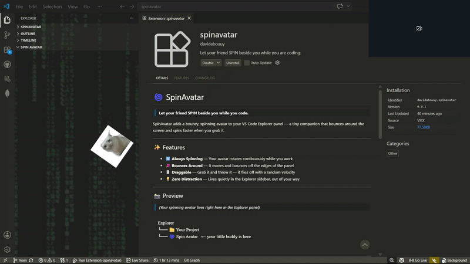
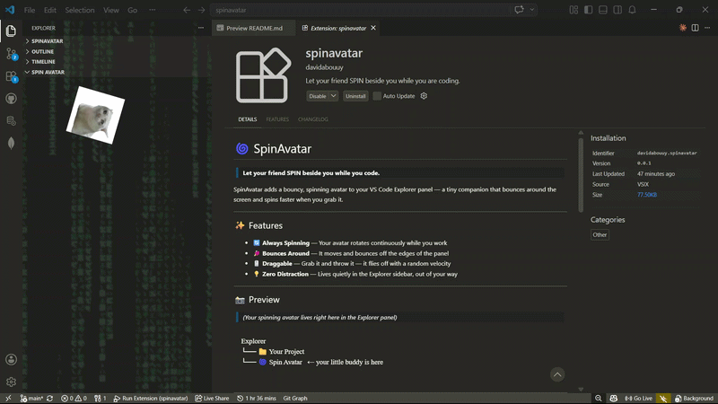

# 🌀 SpinAvatar

> **Let your friend SPIN beside you while you code.**

SpinAvatar adds a bouncy, spinning avatar to your VS Code Explorer panel — a tiny companion that bounces around the screen and spins faster when you grab it.

---

## ✨ Features

- 🔄 **Always Spinning** — Your avatar rotates continuously while you work
- 🏓 **Bounces Around** — It moves and bounces off the edges of the panel
- 🖱️ **Draggable** — Grab it and throw it — it flies off with a random velocity
- 💡 **Zero Distraction** — Lives quietly in the Explorer sidebar, out of your way

---

## 📸 Preview

> *(Your spinning avatar lives right here in the Explorer panel)*

*(Normal view)*


*(How it looks when users drag the avatar)*


```
Explorer
└── 📁 Your Project
└── 🌀 Spin Avatar   ← your little buddy is here
```

---

## 🚀 Getting Started

1. Install the extension
2. Open the **Explorer** sidebar (`Ctrl+Shift+E`)
3. Scroll down to find the **Spin Avatar** panel
4. Watch your buddy spin 🎉

---

## 🖼️ Customization

Want to use your own image? 


1. Press `ctrl + shift + P` to open **Command Palette**
2. Find `Preferences: Open User Settings (JSON)`
3. Add this line `"spinavatar.imagePath": "<PICTURE_DIRECTORY>"`
3. Open **Command Palette** and Find `Developer: Reload Window`

---

## 📦 Extension Details

| | |
|---|---|
| **Version** | 0.0.2 |
| **VS Code** | ^1.120.0 |
| **Category** | Other |
| **Panel Location** | Explorer Sidebar |

---

## 🛣️ Roadmap

- [ ] Custom image picker from settings
- [ ] Speed control
- [ ] Multiple avatars
- [ ] Sound effects (optional, of course)

---

## 🐛 Known Issues

- The avatar panel must be visible/expanded in Explorer to render
- Very small panel sizes may clip the avatar

---

## 📝 Release Notes

### 0.0.1
- Initial release
- Spinning, bouncing, draggable avatar in Explorer panel

### Upcoming
- Sound effect when users drag the avatar
- Glitch screen effect when avatar hits the edges

---

## 💙 Contributing

PRs and issues welcome. If you have a fun avatar idea or feature request, open an issue!

---

<p align="center">Made with ☕ and a little too much free time.</p>